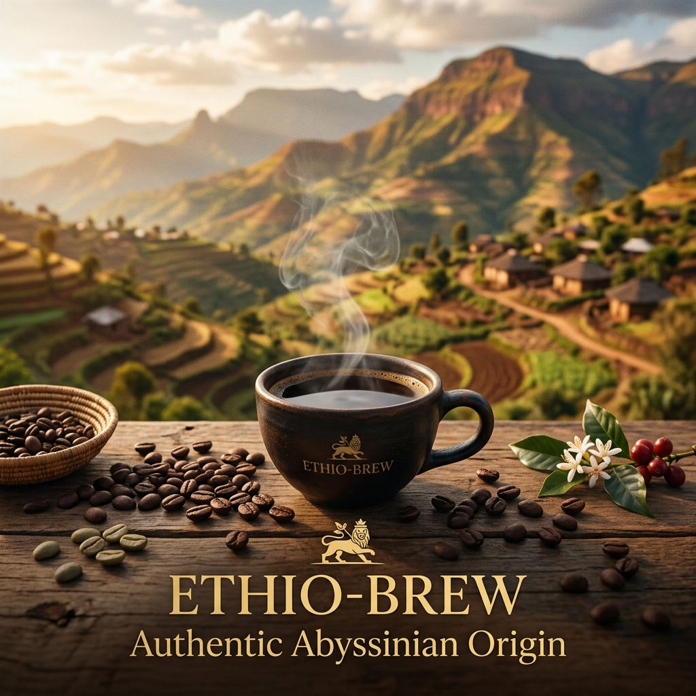
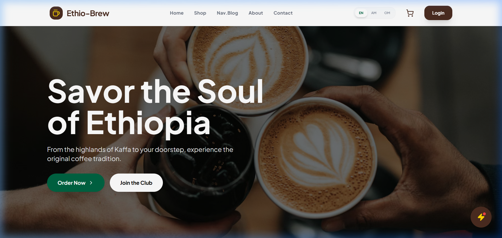
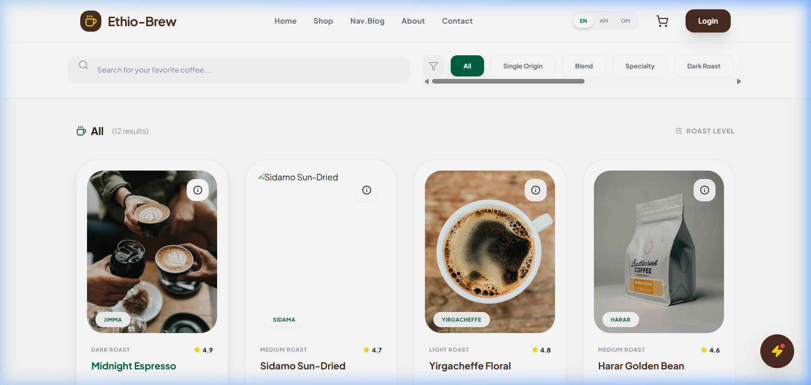
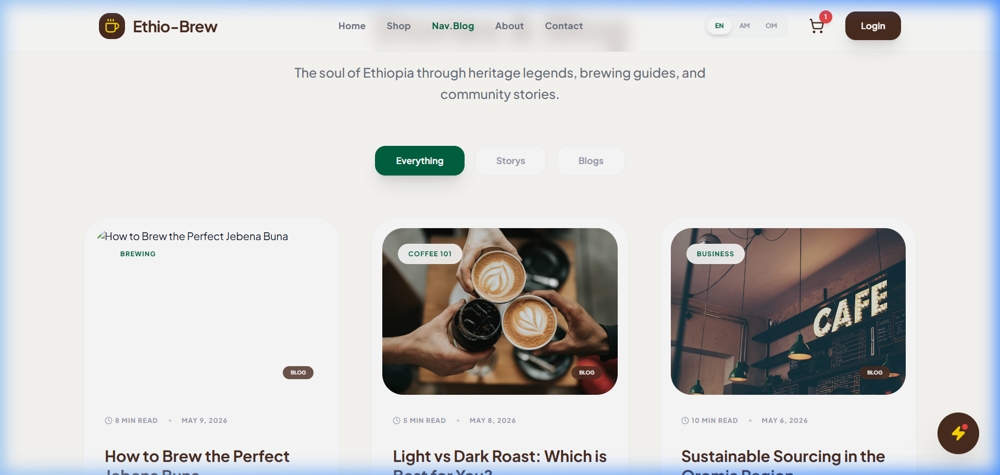
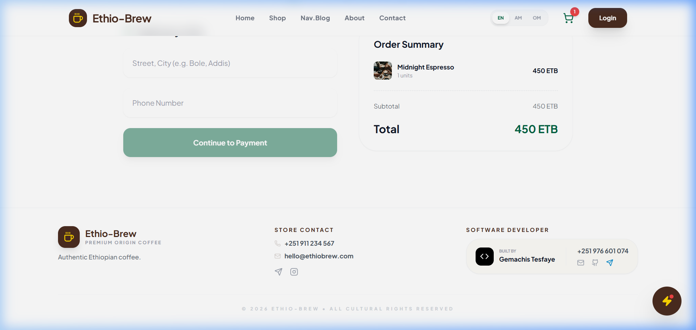
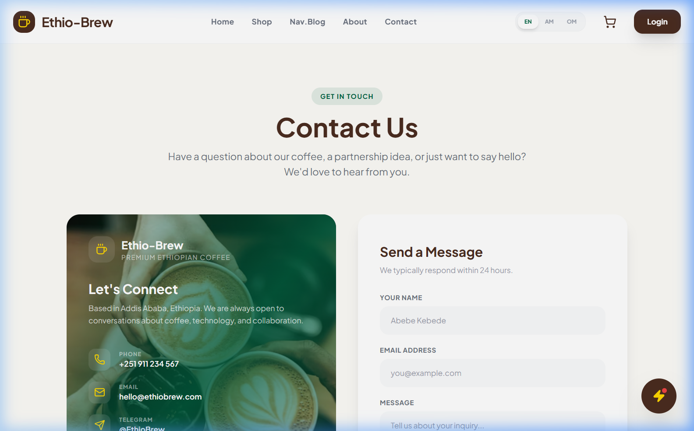

# ☕ Ethio-Brew — AI-Powered Ethiopian Coffee Platform

**Ethio-Brew** is a high-fidelity, production-grade e-commerce ecosystem designed to bring the heritage of Ethiopian coffee into the digital age. Built with **React**, **Node.js**, **MySQL**, and **Google Gemini 2.0 AI**.

---

## 🌐 Live Production Links
| Component | Status | URL |
| :--- | :--- | :--- |
| **Storefront (Vercel)** | 🟢 Online | [https://ethio-brew.vercel.app](https://ethio-brew.vercel.app) |
| **API Backend (Render)** | 🟢 Healthy | [https://ethio-brew-1.onrender.com](https://ethio-brew-1.onrender.com) |
| **Admin Panel** | 🔐 Restricted | [Login to Access](https://ethio-brew.vercel.app/login) |

> [!NOTE]
> **API Monitoring**: The backend includes a built-in health check. Visiting the root URL returns a `Healthy` status and version telemetry.

---

## ✨ Pro Enterprise Features

### 🌍 100% Native Localization
Unlike generic platforms, Ethio-Brew is architected for the Ethiopian market.
- **English**: International standard.
- **Amharic (አማርኛ)**: Full UI and content coverage.
- **Afaan Oromoo**: Native support for the Oromia region.
- *Switch languages instantly with 0.1ms latency.*

### 🤖 AI Coffee Sommelier (Gemini 2.0)
An integrated AI expert trained on Abyssinian coffee heritage.
- **Regional Recommendations**: Personalized suggestions based on Yirgacheffe, Sidamo, or Harar profiles.
- **Multi-Lingual Chat**: Converse naturally in Amharic, Oromifa, or English.
- **Cultural Wisdom**: Deep knowledge of the traditional *Jebena Buna* ceremony.

### 🛡️ Enterprise-Grade Security
- **JWT Authentication**: Secure role-based access for Customers and Admins.
- **Email Verification**: Real-world SMTP integration for account hardening.
- **Payment Verification**: Manual proof-of-payment workflow optimized for local banking (Telebirr/CBE).

---

## 🚧 Platform Limitations
> [!IMPORTANT]
> **Beta Status**: This platform is currently in a high-priority stabilization phase.

1. **AI Language Maturity**: Full conversational support for Amharic and Afaan Oromoo is currently under active development. While the AI is trained on these languages, users may experience occasional English interjections for specialized coffee science terms. We are working towards a 100% pure local language experience.
2. **Real-Time Tracking**: Order tracking status is updated manually by the Admin team after payment verification.
3. **Regional Delivery**: Shipping calculations are currently optimized for Addis Ababa and major regional hubs.

---

## 🎨 Product Gallery

| **Home Page** | **Coffee Shop** | **Product Discovery** |
| :---: | :---: | :---: |
|  |  |  |
| *Cinematic landing experience* | *Dynamic coffee catalog* | *Regional varieties* |

| **Stories & Blog** | **Checkout Flow** | **Contact Center** |
| :---: | :---: | :---: |
|  |  |  |
| *Cultural heritage portal* | *Secure order process* | *Customer support* |

---

## 📡 Infrastructure Configuration

### 📡 Backend (Render)
- `FRONTEND_URL`: `https://ethio-brew.vercel.app`
- `EMAIL_USER`: System SMTP endpoint.
- `GEMINI_API_KEY`: Google AI integration key.

---

## 👤 Developer Profile
**Gemachis Tesfaye**  
*Full Stack Software Engineer*

- 📞 **Phone**: +251 976 601 074
- 📧 **Email**: [gemachistesfaye36@gmail.com](mailto:gemachistesfaye36@gmail.com)
- 📍 **Telegram**: [@urjiiko1](https://t.me/urjiiko1)

---
*© 2026 Ethio-Brew — Preserving Heritage, Brewing Excellence.*
