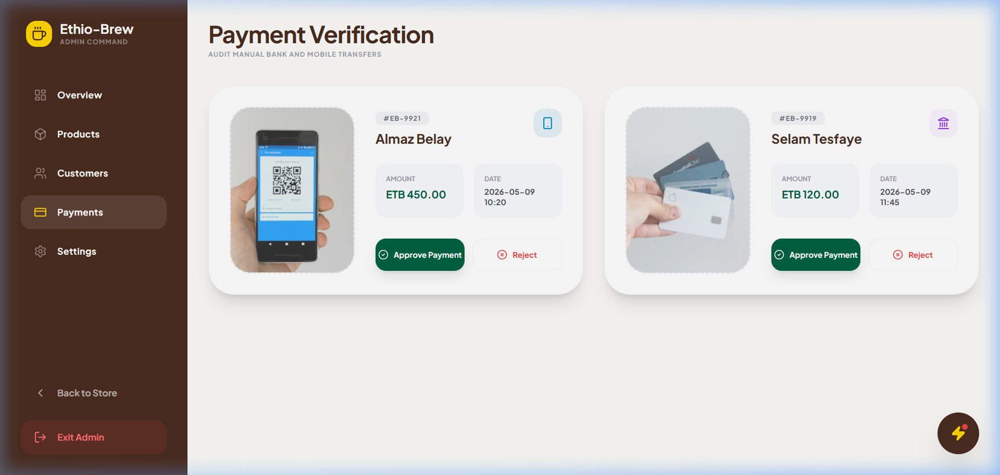
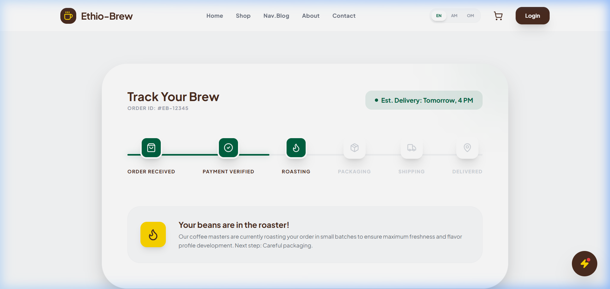
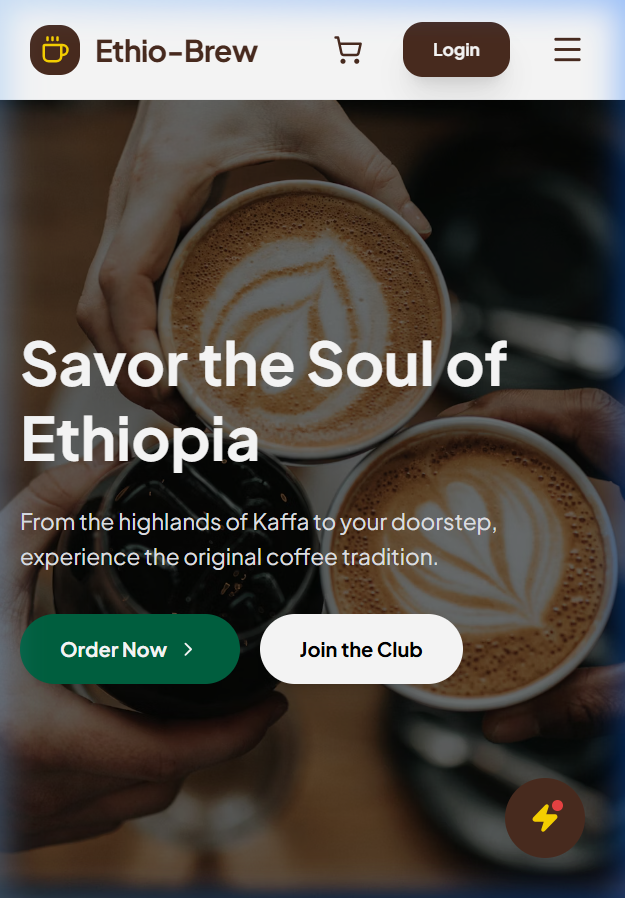

# ☕ Ethio-Brew — AI-Powered Ethiopian Coffee Platform

**Ethio-Brew** is a high-fidelity, production-grade e-commerce ecosystem designed to bring the heritage of Ethiopian coffee into the digital age. Built with **React**, **Node.js**, **MySQL** and **Google Gemini 2.0 AI**.

---

## 🌐 Live Production
| Component | Status | URL |
| :--- | :--- | :--- |
| **Storefront** | 🟢 Online | [https://ethio-brew.vercel.app](https://ethio-brew.vercel.app) |
| **API Backend** | 🟢 Healthy | [https://ethio-brew-1.onrender.com](https://ethio-brew-1.onrender.com) |
| **Admin Panel** | 🔐 Restricted | [Login to Access](https://ethio-brew.vercel.app/login) |

> [!NOTE]
> **API Monitoring**: The backend includes a built-in health check. Visiting the root URL returns a `Healthy` status and version telemetry.

---

## ✨ Core Pillars

### 🌍 100% Native Localization
Architected specifically for the Ethiopian market with zero latency language switching.
- **English**: International standard.
- **Amharic (አማርኛ)**: Full UI and heritage content coverage.
- **Afaan Oromoo**: Native support for the Oromia region.

### 🤖 AI Coffee Sommelier (Gemini 2.0)
An elite AI expert trained on Abyssinian coffee history and flavor profiles.
- **Recommendations**: Personalized suggestions based on regional bean profiles.
- **Multi-Lingual Chat**: Converse naturally in Amharic, Oromifa or English.
- **Heritage Knowledge**: Deep understanding of the traditional *Jebena Buna* ceremony.

### 🛡️ Enterprise Security
- **JWT Auth**: Secure role-based access control (RBAC).
- **Email Verification**: Production SMTP integration for account security.
- **Local Payments**: Optimized manual verification for Telebirr and CBE.

---

## 🎨 Product Gallery

| **Home Page** | **Coffee Shop** | **Product Discovery** |
| :---: | :---: | :---: |
|  |  |  |
| *Cinematic landing* | *Dynamic catalog* | *Regional varieties* |

| **Stories & Blog** | **Checkout Flow** | **Contact Center** |
| :---: | :---: | :---: |
|  |  |  |
| *Heritage portal* | *Secure ordering* | *Support portal* |

| **Admin Command** | **Live Tracking** | **Mobile Experience** |
| :---: | :---: | :---: |
|  |  |  |
| *Business BI center* | *Real-time tracker* | *Fully responsive* |

---

## 🛠️ Technical Infrastructure

### 📡 Backend Configuration (Render)
| Variable | Purpose |
| :--- | :--- |
| `DB_HOST` | Aiven/AWS MySQL Host. |
| `EMAIL_USER` | System SMTP Email Address. |
| `EMAIL_PASS` | Google Security App Password. |
| `GEMINI_API_KEY` | Google AI Integration Key. |

### 🎨 Frontend Configuration (Vercel)
| Variable | Purpose |
| :--- | :--- |
| `VITE_API_URL` | Live connection to Production API. |

---

## 🚧 Platform Limitations
> [!IMPORTANT]
> **Stabilization Phase**: This platform is currently in a high-priority Beta.

1. **AI Language Maturity**: Full conversational support for Amharic and Afaan Oromoo is under active optimization. We are working towards a 100% pure local language experience.
2. **Real-Time Tracking**: Status is updated manually by the Admin team post-verification.
3. **Regional Delivery**: Logistics are currently optimized for Addis Ababa and regional hubs.

---

## 👤 Developer Profile
**Gemachis Tesfaye**  
*Full Stack Software Engineer*

- 📞 **Phone**: +251 976 601 074
- 📧 **Email**: [gemachistesfaye36@gmail.com](mailto:gemachistesfaye36@gmail.com)
- 📍 **Telegram**: [@urjiiko1](https://t.me/urjiiko1)

---
*© 2026 Ethio-Brew — Preserving Heritage, Brewing Excellence.*
